# ModelInspector

<p align="center">
  
</p>

Inspect `.safetensors`, `.gguf`, `onnx` and index various other model files from a desktop GUI and CLI.

## What It Does

- Detects architecture families and variants (Flux, SDXL/SD3, Wan, Hunyuan, Qwen, HiDream, LTX, Z-Image, Chroma, and more)
- Detects adapter type (`LoRA`, `LyCORIS`, `LoHa`, `LoKr`, `DoRA`, `GLoRA`)
- Extracts training metadata when present (steps, epochs, images, resolution, software, and related fields)
- File or folder workflows (including recursive folder scanning)
- `.modelinfo` and `.modelinfo.json` key dumps
- Read-only metadata/tensor inspection

## Setup

- install the wheel, run `python -m modelinspector-gui` for the GUI or `python -m modelinspector` to use the CLI
- Windows .exe provided by github's action runner, run the executeable for GUI

## CLI Usage

### Inspect one or more files

```bat
python src/inspect_model.py path/to/model1.safetensors path/to/model2.safetensors
python src/inspect_model.py path/to/model.gguf
```

### Inspect folders

```bat
python src/inspect_model.py path/to/folder
python src/inspect_model.py path/to/folder --recursive
```

### JSON output

```bat
python src/inspect_model.py path/to/folder --recursive --json
python src/inspect_model.py path/to/folder --recursive --threads 4 --json
```

### Write `.modelinfo` files

```bat
python src/inspect_model.py path/to/folder --recursive --write-modelinfo
```

### Write JSON `.modelinfo` files

```bat
python src/inspect_model.py path/to/folder --recursive --write-modelinfo-json
```

### Dump key/debug report text to console

```bat
python src/inspect_model.py path/to/folder --recursive --dump-keys
```

### Optional alias fallback (filename tokens)

```bat
python src/inspect_model.py path/to/folder --recursive --allow-filename-alias-detection
```

## GUI Walkthrough

### Main Window

- Drag and drop files or folders onto the window
- Use `Open` menu to open a file/folder or load previously cached model data
   - `Load Cache`: loads only cached models that still exists at their paths
   - `Load Cache All`: loads cached data for all models stored
   - `Load Cache Archived`: loads only cached model data for missing model files
- `Settings` control visibility and behavior
- Filters based on architecture, tags and file format
- Dropdown to select action button effect, action button affects only selected model/models
- `Clear All` button to empty the list

#### Tab: Cards

- Simple model Cards.
- Click on checkbox to select model.
- Click on model card to open advanced model View
- Right click for advanced view/raw view/copy info for selected model

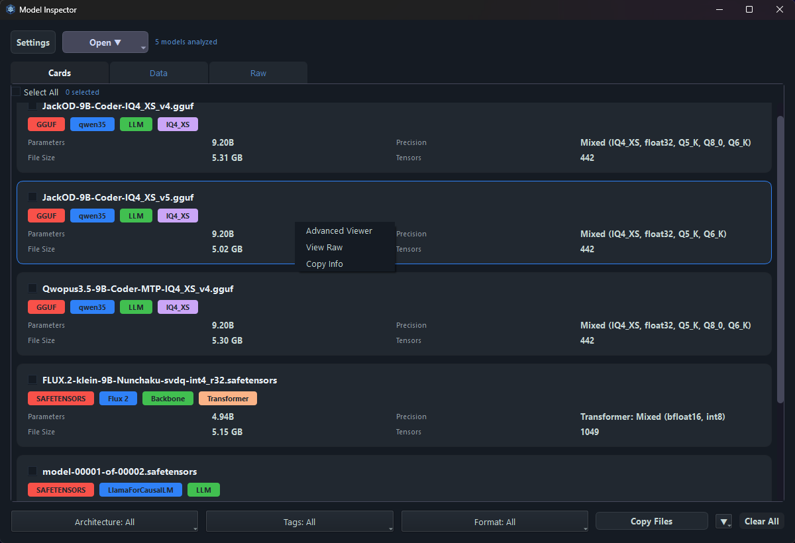

### Tab: Data

- Sortable/resizable table
- Multi-select cells and copy via `Ctrl+C` or via right click
- Right-click actions
   - Advanced View (on model right clicked on)
   - View Raw (on model right clicked on)
   - Copy Folder Path (on model right clicked on)
   - Copy Selected Entries (all selected cells in the grid get copied tab delimited)
- Column visibility, order and width can be configured in settings
   - Widths can also be adjusted by dragging, when done enter settings and press OK to save dragged sizes
- Sorting the table also reorders the Cards tab and Raw model dropdown

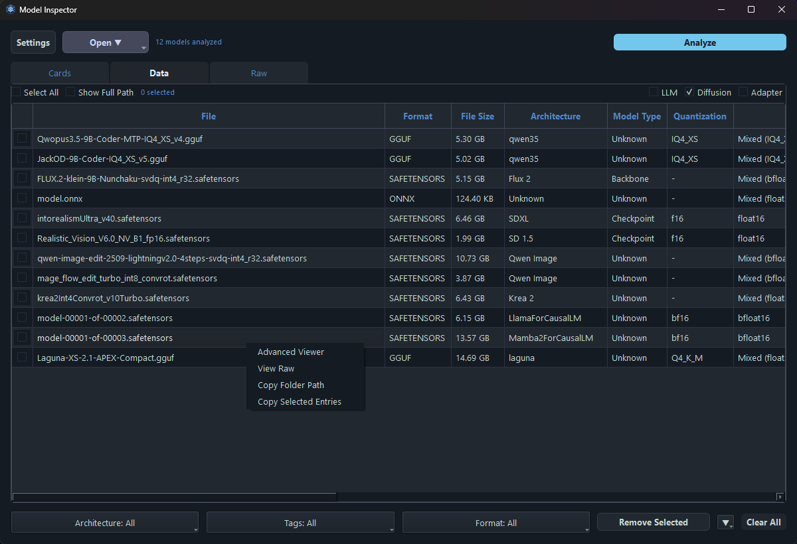

### Tab: Raw

- Per-model raw `.modelinfo` text view
- `View Raw` context action jumps here for the selected model summary
- `Load Full Dump` explicitly generates and caches the full tensor key dump for the current model
- `Ctrl+C` copies the selected text, or the full raw content when no selection exists

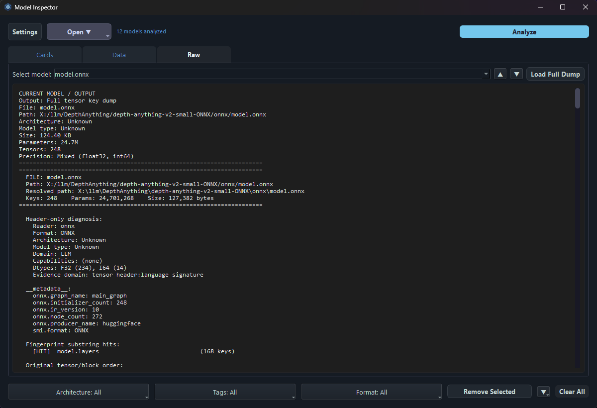

### More app images:

**Settings**

<table>
  <tr>
    <td>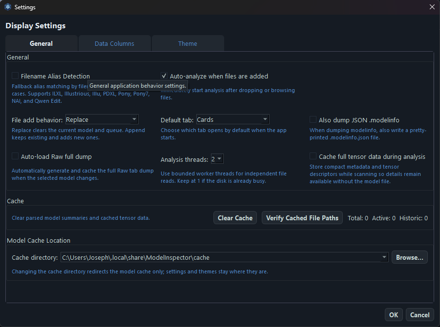</td>
    <td>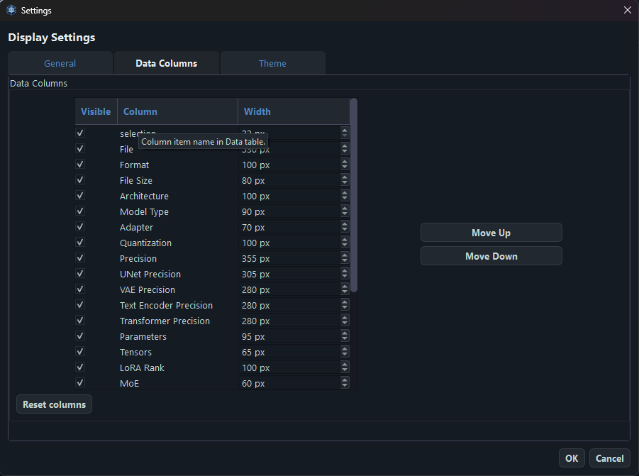</td>
    <td>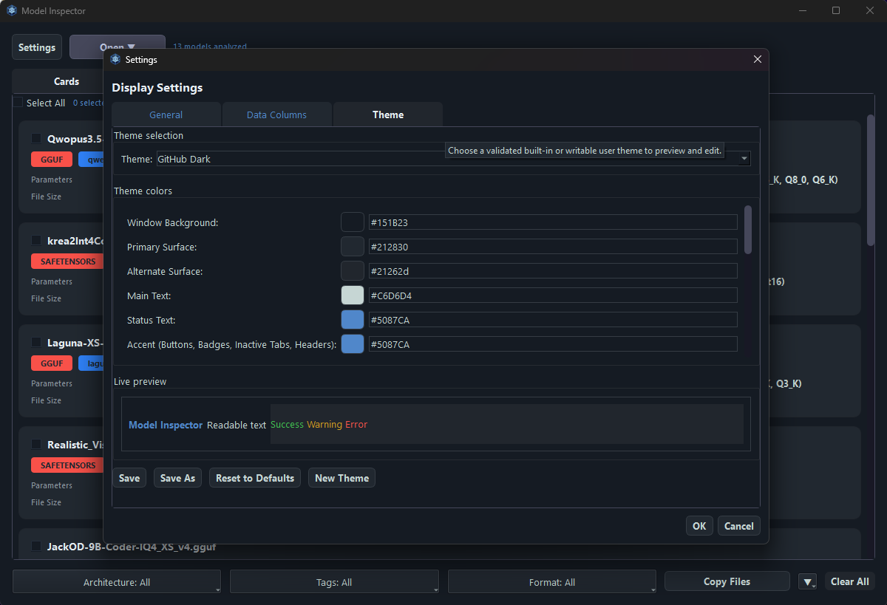</td>
    <td>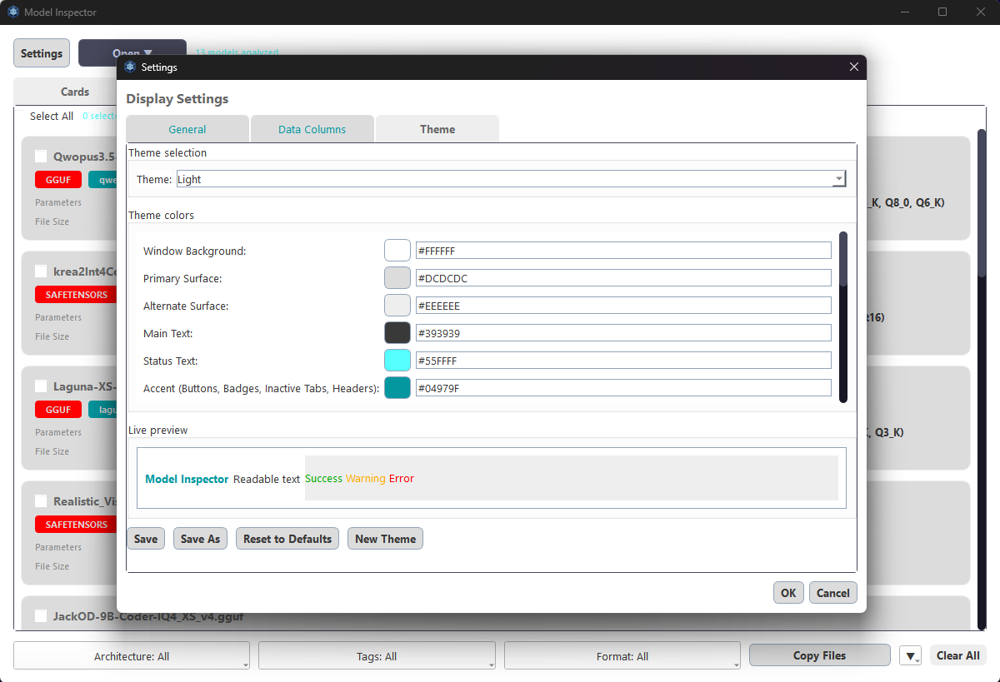</td>
  </tr>
</table>

**Advanced View**

<table>
  <tr>
    <td>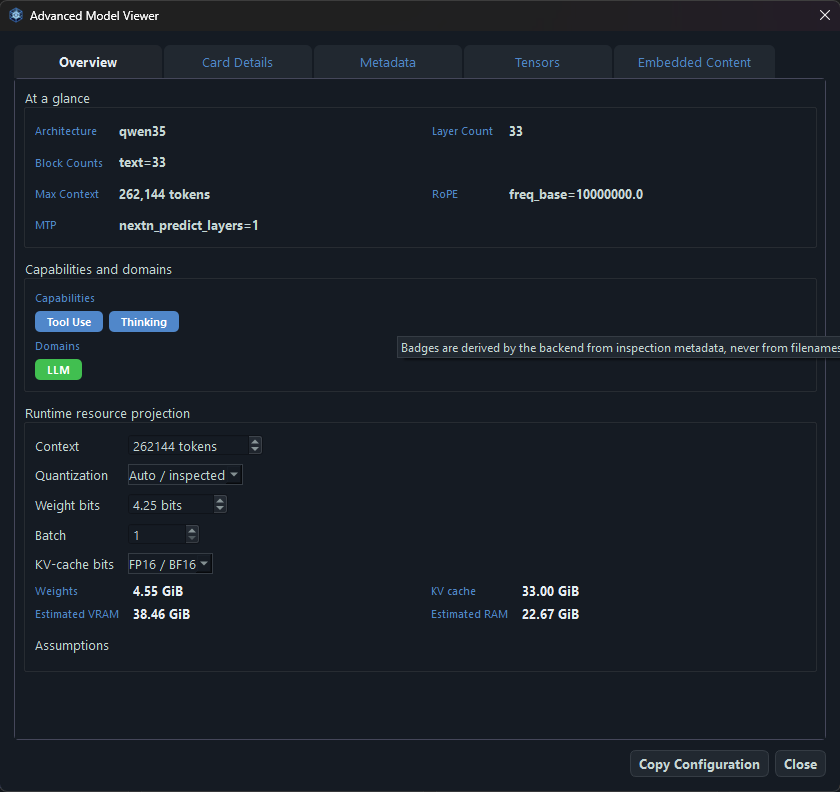</td>
    <td>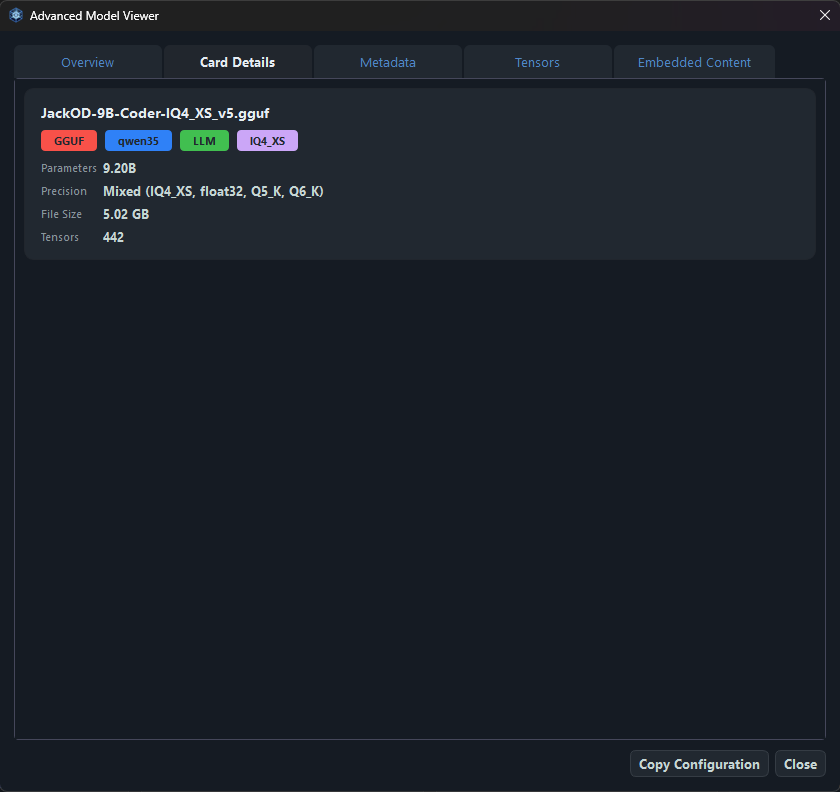</td>
    <td>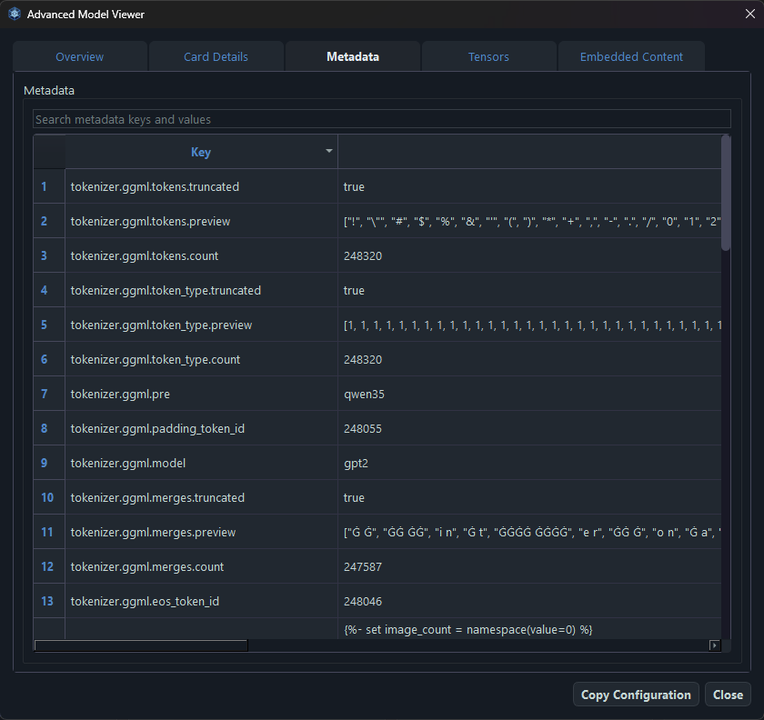</td>
    <td>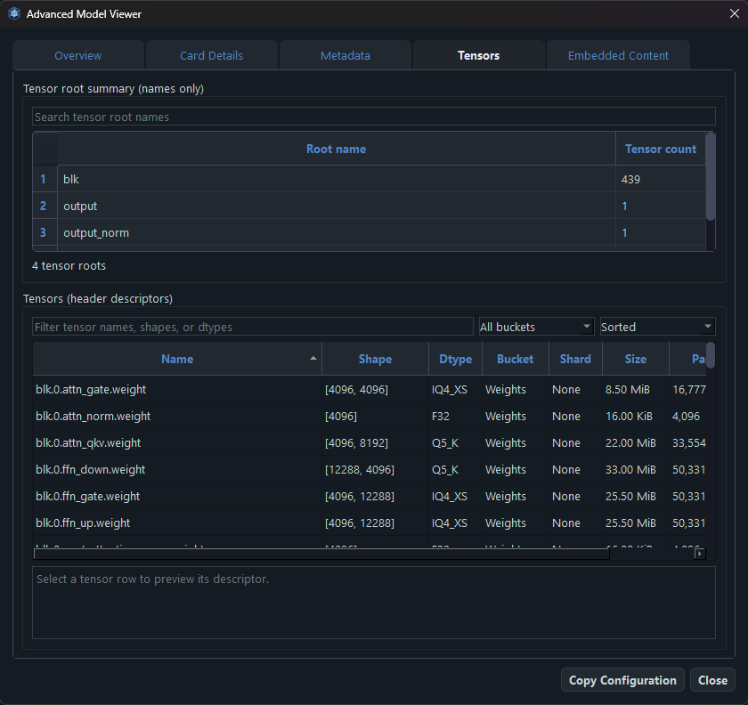</td>
    <td>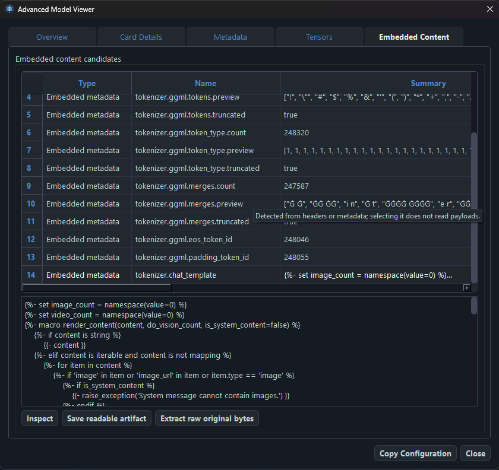</td>
  </tr>
</table>

## Notes

- Folder drag/drop and folder browse both support recursive discovery of `.safetensors`, `.gguf`, `.onnx`, `.ckpt`, `.pt`, and `.pth`.
- Parsed model summaries are cached by resolved path, file size, and modified time to speed up repeat inspections.
- If `Cache full tensor data during analysis` is enabled, compact tensor descriptors are stored under `cache/data/` beside the summary cache and can be used for Raw/modelinfo output even when the model file is unavailable.
- Successful folder scans are cached immediately. The `Load default libraries on startup` setting restores cached scan results on launch.
- App settings and cache default to `~/.local/share/ModelInspector` (`%USERPROFILE%\.local\share\ModelInspector` on Windows). Override with `SMI_DATA_DIR`, `SMI_CACHE_DIR`, or `SMI_SETTINGS_PATH` or command line options.
- The GUI dump button setting writes only selected models; from the Raw tab, with nothing selected, it writes only the current Raw model.
- Filename alias detection is opt-in in Settings and can map filename tokens to fallback labels.
- `Pony7` is treated as distinct from `PDXL`. The alias tokens `pony7`, `ponyv7`, and `pony v7` map to `Pony7`.

See [LICENSE](./LICENSE) for MIT license info.

:)
